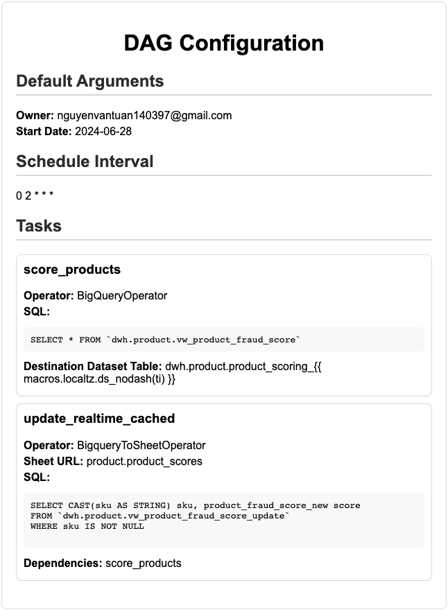

# Airlake Dag Factory
Dynamically build Airflow DAGs from YAML files

**Airlake Factory Tool**




## Install Airlake Factory Package

**Must Have**
```
export PYTHONPATH=$PYTHONPATH:/airfactory
```
**Run Test**
```
make test
```
## Build Lib
```
make dist
```
## Usage This Lib
**Copy airfactory-1.0.0.tar.gz in dist folder to your project**
**Configure requirements.txt**
```
./packages/airfactory-1.0.0.tar.gz
```

**How To Work**

1. Create a YAML configuration file called config_file.yml and save it within your dags folder:
```yaml
apiVersion: v1
kind: DAG
schedule_interval: 0 0 * * *
timetable:
  start_date: '2024-08-01'
  end_date: '2024-08-02'
default_args:
  owner: nguyenvantuan140397@gmail.com
  depends_on_past: false
  email_on_failure: false
  email_on_retry: false
  retries: 1
  default_view: tree
  tags:
    - example
dags:
  test_dag_daily:
    tasks:
      task1:
        operator: airflow.operators.bash.BashOperator
        bash_command: echo 1
        execution_timeout: 60
        sla: 30
      task2:
        operator: airflow.operators.bash.BashOperator
        bash_command: echo 2
        execution_timeout: 60
        sla: 30
        dependencies:
          - task1
```
2. In the same folder, create a python file called generate_dags.py. This file is responsible for generating the DAGs from the configuration file and is a one-time setup. You won't need to modify this file unless you want to add more configuration files or change the configuration file name.
```python
'''
Generated by Airflow Datalake! Do not edit!
author: tuancamtbtx
Timestamp 2024-08-03T17:09:31.157517+07:00
'''

from airflow import DAG

from airfactory.dagfactory import AirlakeDagFactory

config_filepath = "./conf/example_dag_factory.yaml"

factory= AirlakeDagFactory(config_filepath=config_filepath)
factory.cleans_dags()
factory.generate_dags(globals())

```

## Task Group
When to use task groups
-Task groups are most often used to visually organize complicated DAGs. For example, you might use task groups:

- In big ELT/ETL DAGs, where you have a task group per table or schema.
- In MLOps DAGs, where you have a task group per model being trained.
- In DAGs owned by several teams, where you have task groups to visually separate the tasks that belong to each team. Although in this case, it might be better to separate the DAG into multiple DAGs and use Datasets to connect them.
- When you are using the same patterns of tasks in multiple DAGs and want to create a reusable module.
- When you have an input of unknown length, for example an unknown number of files in a directory. You can use task groups to dynamically map over the input and create a task group performing sets of actions for each file. - This is the only way to dynamically map sequential tasks in Airflow.
## Benefits
**Design Principle:**
- Sync a table from MySQL/PostgreSQL in 10 lines of config
- Config should be clean, users just need to write minimal key to make a dag run
- Non-Tech users could write it without thinking about programming complex
- Alerting & Retrying must be enable by default
- RBAC Authorization must be provided.
- Users can backfill data when they want, via an UI.

**Runtime Cost**
- This system should be fault-tolerance
- Reduce 70% Cost by Running preemptible VMs